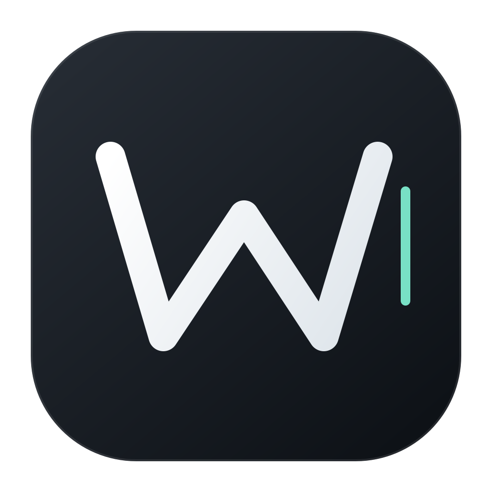
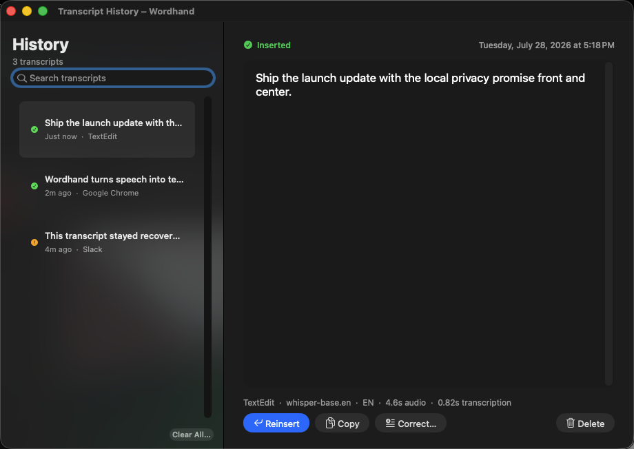

<p align="center">
  
</p>

<h1 align="center">Wordhand</h1>

<p align="center">
  <strong>Local dictation for Mac.</strong><br>
  Hold Control-Space, speak naturally, and put the result at your cursor.
</p>

<p align="center">
  <a href="https://github.com/ValyouHustlin/wordhand/actions/workflows/ci.yml"></a>
  
  
  
</p>

Wordhand is a native macOS voice-to-text app built for the place dictation
actually belongs: the text field you are already using. It records only while
you hold the shortcut, transcribes on-device through WhisperKit and Core ML,
and inserts the result into ordinary Mac apps.

## What is working today

| | |
| --- | --- |
| **Private by architecture** | Audio and transcript processing stay on the Mac. There is no account, remote transcription API, analytics, or transcript sync. |
| **Push to talk** | Hold `Control-Space`, speak, and release. A compact overlay shows recording and transcription state. |
| **Decode-aware dictionary** | Teach Wordhand names, acronyms, product terms, and exact replacements. Canonical spellings condition Whisper before decoding; post-processing remains as a fallback. Changes apply without restarting. |
| **Recoverable history** | Search recent transcripts, inspect insertion status, copy, reinsert, correct, or delete them from a native window. |
| **A real Mac app** | Wordhand lives in both the menu bar and Dock. Clicking its Dock icon opens Settings; history and dictionary are one click away. |
| **Ready after login** | The installed app can register as a native macOS login item. Its interface and shortcut become available immediately while the selected speech model warms in the background. |
| **Accuracy-first local model** | Optimized Whisper Large v3 is the default on capable Macs. Balanced and smaller Whisper models remain selectable. |
| **Natural self-corrections** | Say “wait, no,” “I meant,” “make that,” or “scratch that.” Wordhand removes the abandoned wording locally before formatting. |
| **Maximum Performance preview** | On high-end Apple silicon, opt into formatter prewarming and rolling local transcription while you speak. Adaptive remains the efficient default; attended latency verification is still open. |
| **Reliable insertion** | Paste-first insertion works across native, browser, and Electron targets while restoring the previous rich clipboard. Direct typing and copy-only modes are available. |
| **Flow-focused feedback** | Quiet start/stop tones, an expressive live waveform, a display-following recording control, and one-click cancellation keep dictation legible without demanding attention. |
| **Four writing styles** | Choose Casual, Formatted, Professional, or AI Communication. The three richer modes use Apple’s on-device model with meaning-preservation checks and safe local fallback. |

<p align="center">
  
</p>

## Install from source

Wordhand builds into a normal app bundle with a stable bundle identifier, Dock
icon, menu bar control, and native launch-at-login support. A Developer ID
signature and notarized public download are still in development, so the honest
public path currently requires the Xcode command line tools.

**Requirements:** macOS 14 or newer, an Apple silicon Mac, and approximately
1 GB of free space for the first model.

```sh
git clone https://github.com/ValyouHustlin/wordhand.git
cd wordhand
./scripts/install-app.sh --launch-at-login
```

This installs `Wordhand.app` in `/Applications` when that directory is writable
(otherwise `~/Applications`), moves rollback copies outside the searchable
Applications folders, registers and imports the app for Spotlight, enables
launch at login, and opens it. Local source builds are ad-hoc signed; they are
not a substitute for the planned notarized public release, and macOS may require
permissions again after replacing an ad-hoc-signed build.

For repeated local development installs, use one persistent Keychain
code-signing identity so macOS sees each rebuild as the same app:

```sh
./scripts/configure-local-signing.sh "Your Code Signing Identity"
./scripts/install-app.sh --launch-at-login
```

The configuration stores only the identity's display name at
`~/Library/Application Support/Wordhand/signing-identity`; the private key
remains in Keychain. The public release path still requires Developer ID
signing and notarization.

On first launch, macOS asks for Microphone, Input Monitoring, and Accessibility
access. Wordhand keeps Settings open with a separate, truthful status and repair
action for each grant. Input Monitoring detects the global shortcut,
Accessibility inserts the result, and Microphone captures speech. macOS
secure-input fields intentionally block text injection; Wordhand keeps the
transcript in history instead of treating a password field as a valid target.

## Daily use

1. Put the cursor where the text should go.
2. Hold `Control-Space`.
3. Speak.
4. Release the shortcut.

The recording stays local, the transcript is saved to local history, and the
text appears at the cursor.

### Privacy boundaries

Wordhand does not send audio, transcripts, dictionary terms, or formatting
prompts to a server. Whisper decoding runs in the local WhisperKit/Core ML
pipeline. AI-prompt formatting uses Apple's on-device Foundation Models
framework when available and deterministic local cleanup otherwise.

User vocabulary, settings, and transcript history live only under
`~/Library/Application Support/Wordhand`. The public repository ships a
versioned starter vocabulary, then installs it as ordinary editable dictionary
entries. Future starter updates merge non-destructively; a term a user deletes
does not silently return at the same seed version. Dictionary files are
owner-readable only (`0600`), as are settings and history; their containing
directory is owner-accessible only (`0700`). Wordhand prioritizes recent user
corrections and uses at most 24 canonical terms per decode so a large dictionary
does not drown out the terms that matter now. Editable pronunciation variants
also tell the recognizer that, for example, a commonly heard phrase is written
with a particular canonical spelling; the same entry remains a deterministic
post-processing fallback.

If macOS uses `Control-Space` to switch input sources, disable **Select the
previous input source** under **System Settings > Keyboard > Keyboard
Shortcuts > Input Sources**.

## Commands

```sh
wordhand                                 # run in the foreground
wordhand setup                           # permissions and model setup
wordhand doctor                          # diagnose permissions and shortcut conflicts
wordhand models list                     # list local transcription models
wordhand models download <id>            # download a model before first use
wordhand models benchmark <audio> --model <id>
wordhand dictionary add --heard-as "tee mux" --replace-with "tmux"
wordhand format "dictated text" --style professional
wordhand install --launch-at-login       # register Wordhand at login
wordhand install --uninstall             # remove launch-at-login registration
wordhand --model whisper-large-v3-turbo  # use a larger multilingual model
wordhand --no-overlay                    # hide the recording overlay
```

Existing data from the earlier Parrot-branded build is copied automatically
into `~/Library/Application Support/Wordhand` the first time Wordhand runs. The
old directory is preserved as a rollback copy.

## Built locally, tested honestly

The package contains a deterministic test target for the model registry,
settings, transcript processing, dictionary matching, decode-prompt generation
and persistence, history, hotkey state, coordinator behavior, and data
migration.

```sh
/usr/bin/xcrun swift test
/usr/bin/xcrun swift build -c release
```

Hardware-facing behavior still requires real Mac verification. Dated receipts
live in [`docs/verification`](docs/verification), including what was observed
and what remains unverified.

### Development safety

Wordhand's interactive runtime owns a global keyboard event tap and can post
synthetic input into the focused application. Do not run it unattended on a Mac
with other active work. Set `WORDHAND_SAFE=1` to make the `run` command refuse
startup before it installs global input:

```sh
WORDHAND_SAFE=1 .build/debug/wordhand run
```

Contributors should exercise shortcut and insertion behavior through the fake
adapters in `WordhandMacTests`. A real development tap test requires explicit
opt-in, a maximum 30-second timeout, active attendance, and a clear terminal
dedicated to the test. The immediate kill command is
`/usr/bin/pkill -x wordhand`.

## Roadmap

The next daily-use slices are immediate undo/revert, fresh-account onboarding,
an attended Maximum Performance latency pass, and a signed release path. See
[the product roadmap](.plan/plan.md) and
[architecture](docs/architecture.md).

## Provenance and license status

Wordhand began as a fork of
[`digimata/parrot`](https://github.com/digimata/parrot) and has deliberately
grown beyond that project's minimalist scope.

The upstream repository currently contains no software license. This repository
is therefore public source, but it is not yet accurate to describe the inherited
code as carrying an open-source license. See [NOTICE.md](NOTICE.md) for the
exact status. Resolving that provenance is a release prerequisite.
